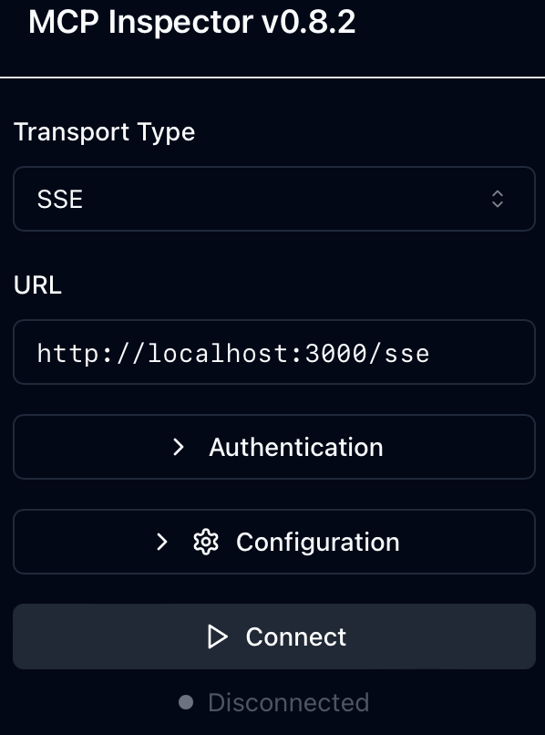
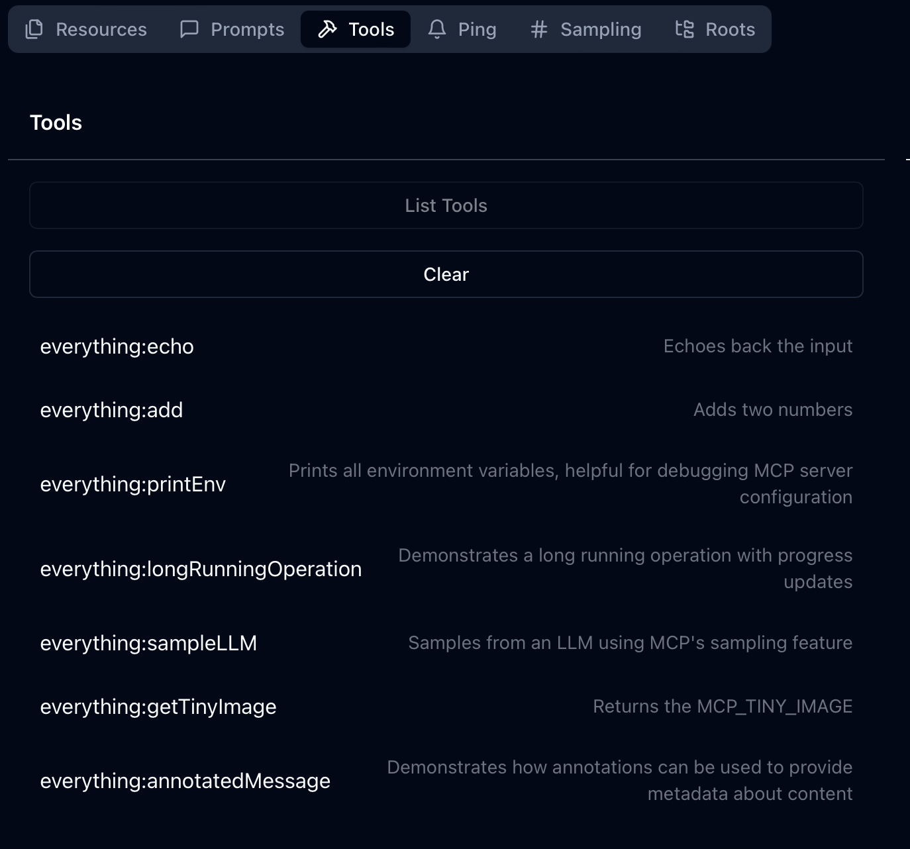
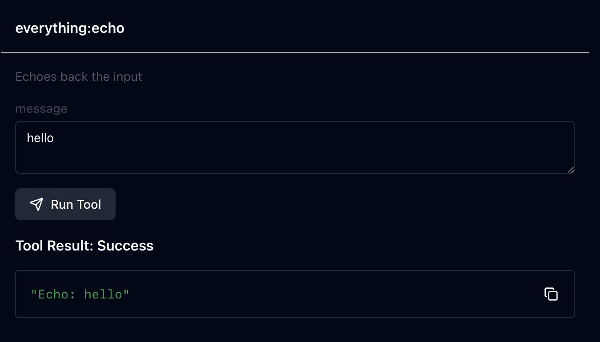

## Basic Example

This example shows how to use the agentgateway to proxy requests to the `everything` tool.

### Running the example

```bash
cargo run -- -f examples/mcp-basic/config.yaml
```

Let's look at the config to understand what's going on.

```yaml
mcp:
  port: 3000
  targets:
  - name: everything
    stdio:
      cmd: npx
      args: ["@modelcontextprotocol/server-everything"]
```

We have a few concepts to understand here:
* `mcp.port` is the port the MCP server listens on.
* `mcp.targets` contains the MCP servers exposed through the gateway.
* `stdio` targets run a local command and proxy MCP traffic to it.

For MCP targets, we can connect to MCP servers over HTTP or Stdio.
Additionally, we can connect to *multiple* MCP servers, and expose them all as one aggregated server.
In this example, we will connect to one server over Stdio.

```yaml
mcp:
  targets:
  - name: everything
    stdio:
      cmd: npx
      args: ["@modelcontextprotocol/server-everything"]
```

> [!TIP]
> If you don't have `npx`, you can also run with docker:
> ```yaml
> stdio:
>   cmd: docker
>   args: ["run", "--rm", "-i", "mcp/everything"]
> ```

When clients connect to the gateway, the `cmd` will be executed to serve the traffic.

Now that we have the gateway running, we can use the [mcpinspector](https://github.com/modelcontextprotocol/inspector) to try it out.
```bash
npx @modelcontextprotocol/inspector
```
Once the inspector is running, it will present the port that it's running on, and then you can navigate to it in your browser.



Agentgateway supports both SSE (served under `/sse`) and streamable HTTP (served under `/mcp`).

Once you're connected, you can navigate to the tools tab and see the available tools.



Let's try out one of the tools, like `everything:echo`.



That worked! The gateway was able to proxy the request to the `everything` tool and return the response.
