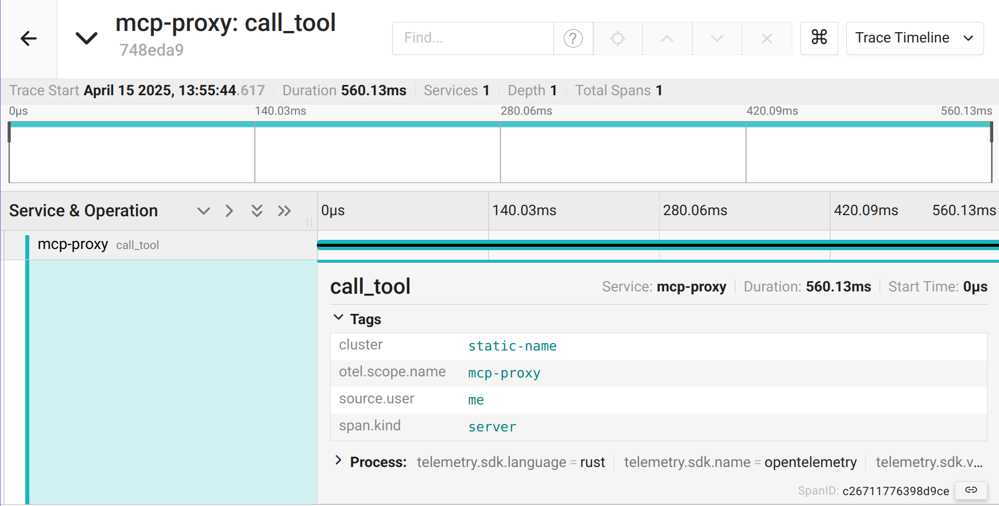

## Telemetry Example

This example shows how to use the agentgateway to visualize traces and metrics for MCP calls.
Telemetry can be combined with the [RBAC sample](../mcp-authorization), but this example keeps the MCP backend focused on tracing and metrics.

### Running the example

```bash
cargo run -- -f examples/mcp-telemetry/config.yaml
```

Let's look at the config to understand what's going on.

In addition to the baseline MCP configuration, the example enables frontend tracing.

```yaml
frontendPolicies:
  tracing:
    host: localhost:4317
    randomSampling: true
```

Here, we configure sending traces to an [OTLP](https://opentelemetry.io/docs/specs/otel/protocol/) endpoint.

For metrics, they are enabled by default so no configuration is needed

Next, we will want to get a tracing backend running.
You can use any OTLP endpoint if you already have one, or run the local collector and Jaeger stack:

```bash
docker compose -f examples/mcp-telemetry/docker-compose.yaml up -d
```

Send a few requests from the MCP inspector to generate some telemetry.

Now we can open the [Jaeger UI](http://localhost:16686/search) and search for our spans:



We can also see the metrics (typically, Prometheus would scrape these):

```
$ curl localhost:15020/metrics -s | grep -v '#'
tool_calls_total{server="everything",name="echo"} 1
tool_calls_total{server="everything",name="add"} 1
list_calls_total{resource_type="tool"} 3
agentgateway_requests_total{gateway="bind/3000",method="POST",status="200"} 9
agentgateway_requests_total{gateway="bind/3000",method="POST",status="202"} 4
agentgateway_requests_total{gateway="bind/3000",method="GET",status="200"} 1
agentgateway_requests_total{gateway="bind/3000",method="DELETE",status="202"} 2
```
